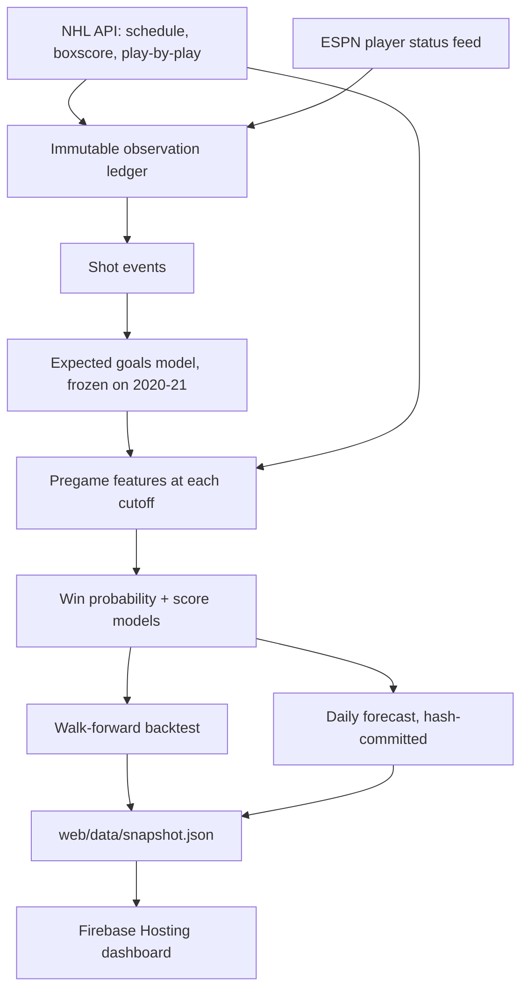

# NHL Predictor

Point-in-time NHL game forecasting. Every prediction is built only from
information that existed before puck drop, so historical backtests estimate what
the model *would* have said at the time rather than what it can say with
hindsight.

**Live dashboard: https://jessiewtx-nhl-predictor.web.app**

---

## Current honest results

Walk-forward backtest, 2022-23 through 2024-25 regular seasons:

| metric | value |
|---|---|
| games evaluated | 3,936 |
| accuracy | 59.91% |
| always-pick-home baseline | 54.24% |
| lift over baseline | +5.67 pt |
| log loss | 0.66386 |
| Brier score | 0.23578 |
| goal MAE | ~1.40 per side |

**What these numbers do and do not mean.** They are retrodiction: the model has
never predicted a game nobody had played yet. They have not been compared
against closing betting odds, which is the only benchmark that would show
whether the model beats public consensus. Treat "beats the market" as unknown.

**Why the ceiling is low.** 20.7% of NHL games are decided in overtime or a
shootout (measured on 2024-25: 1,041 regulation, 194 OT, 77 SO out of 1,312).
Those are close to coin flips regardless of team quality, which caps how good
any model can be. Roughly 62% accuracy is near the practical limit. If a change
ever produces 70%+, assume a leakage bug before celebrating.

---

## Quick start

```bash
python3 -m venv .venv
source .venv/bin/activate
python -m pip install -e ".[dev]"

pytest                      # 42 tests
./scripts/reproduce.sh      # rebuild the headline number (~2 min)
```

`reproduce.sh --full` also re-downloads all games and shots from the NHL API
(~35 min). Raw data is gitignored, so a fresh clone needs the `--full` path once.

---

## Architecture



### The rule everything obeys

A prediction for a game may use only records whose `available_at_utc` precedes
that game's `prediction_cutoff_utc`. Two cutoffs exist per game:

- **morning** — 10:00 AM Eastern on game day
- **final** — 30 minutes before puck drop (the default)

Completed results enter team state only after `result_available_at_utc`.
Historical NHL schedules do not publish a wall-clock final time, so when that
column is absent the code substitutes **puck drop + 4 hours**. This is
deliberately conservative — it can hide real same-day signal, but it cannot
expose a score early. It is an assumption, not an observation, and is the
weakest link in the point-in-time claim.

---

## Module map

| file | responsibility |
|---|---|
| `schema.py` | Canonical columns, `FEATURE_COLUMNS`, `FEATURE_GROUPS`, `PlayerStatus`, `SourceTier` |
| `nhl_api.py` | NHL schedule/boxscore/play-by-play client with retry+backoff; official capture |
| `espn_api.py` | ESPN per-player status feed (the fantasy-page data), mapped to `PlayerStatus` |
| `shots.py` | Extracts shot events with coordinates, type, strength state |
| `expected_goals.py` | xG model; `EVALUATION_EXCLUDED_COLUMN` marks its training games |
| `features.py` | `build_pregame_features` — cutoff-aware Elo, rest, scoring, xG rates |
| `predictor.py` | Logistic win model + two Poisson score models |
| `regulation.py` | Three-way regulation model with separate weak overtime tiebreak (built, not yet adopted) |
| `backtest.py` | `walk_forward_backtest`, `run_ablation`, calibration |
| `cutoffs.py` | Morning/final cutoff policy |
| `ledger.py` | Append-only observation store, snapshots, prediction provenance |
| `commitment.py` | Hash-chained pregame commitments |
| `verification.py` | Adversarial leakage checks |
| `workflow.py` | Daily two-pass forecast orchestration |
| `publish.py` | Builds `web/data/snapshot.json` |
| `cli.py` | All commands |
| `modal_app.py` | Scheduled cloud jobs |

---

## Trust and verification

Good backtest numbers are easy to produce by accident. These checks exist to
make that harder:

```bash
nhl-predictor verify --games data/raw/games_with_xg.csv
```

| check | latest result |
|---|---|
| permuted outcomes show no skill | accuracy 53.6% vs 53.7% baseline, log loss 0.6920 (coin flip) |
| past features ignore future games | 0.00e+00 max difference across 3,057 games × 17 features |
| features are reproducible | identical across runs |
| no feature reveals the outcome | strongest correlation 0.233 |

The permutation check is the important one: shuffle which game got which result
and the model must lose all skill. It does.

Data is real — sampled games verified against the NHL's own API (TOR@WPG 6-4,
SJS@DAL 5-4, NSH@CHI 4-5, BOS@LAK 5-2, NYR@BOS 5-2, OTT@TBL 1-5, 6/6 match).

### Forward predictions are tamper-evident

Live forecasts are hashed before puck drop and appended to a chained log at
`data/ledger/commitments.jsonl`; each entry carries the previous entry's hash.

```python
from nhl_predictor.commitment import verify_chain
verify_chain()
```

This proves a forecast was not revised after the fact. It does not prove it was
good.

---

## A correction worth knowing about (2026-08-15)

An earlier version of this README claimed **60.44% accuracy over 5,607 games**.
That number was inflated by real leakage, found by an adversarial audit run on a
different model family.

The xG model is fitted on 2020-21 and 2021-22 shots and then frozen. That part
is correct — a model trained on those seasons genuinely existed before 2022, so
using it to predict later games is legitimate. The error was **also evaluating
on those two seasons**, which meant 1,671 of 5,607 scored games (29.8%) had xG
features produced by a model that had seen their own shot outcomes.

The fix: `build-xg` now marks those games with `in_xg_training_window`, and the
backtest keeps them in *training* while never *scoring* them. Corrected result:
3,936 games, 59.91%, log loss 0.66386. `tests/test_verification.py` has a
regression test.

**Lesson for whoever picks this up:** freezing a feature model is only half the
job. You also have to exclude its training window from evaluation.

---

## What each feature group actually buys

Ablation adds one group at a time and re-runs the full walk-forward backtest.
Log loss decides; a group that does not lower it gets deleted.

| configuration | accuracy | log loss | gain |
|---|---|---|---|
| home-win rate only | 54.24% | 0.68971 | — |
| + Elo | 58.56% | 0.66863 | **+0.02108** |
| + scoring rates | 58.89% | 0.66868 | −0.00005 |
| + rest/schedule | 59.07% | 0.66753 | +0.00116 |
| + head-to-head | 59.17% | 0.66767 | −0.00015 |
| + experience | 59.25% | 0.66783 | −0.00015 |
| + expected goals | 59.91% | 0.66386 | **+0.00396** |

Only **Elo** and **expected goals** earn their place. The xG gain has a 95%
bootstrap CI of [+0.0003, +0.0077] over 3,936 paired games — real, but close
enough to zero that it should not be oversold. Scoring rates, head-to-head, and
experience are noise and are retained only so the ablation keeps measuring them.

Head-to-head deserves a specific note: the intuition that "team A always beats
team B" does not survive measurement. It is heavily smoothed and still useless.

---

## Data sources

| source | what it gives | caveat |
|---|---|---|
| `api-web.nhle.com/v1/schedule/{date}` | Games, scores, `lastPeriodType` | Returns a 7-day week per request |
| `api-web.nhle.com/v1/gamecenter/{id}/play-by-play` | Shots with x/y, type, strength, goalie | ~110 shots per game |
| `api-web.nhle.com/v1/gamecenter/{id}/boxscore` | Actual starting goalie (`starter: true`) | Post-game only; label verification, never a feature |
| `api-web.nhle.com/v1/gamecenter/{id}/right-rail` | Official scratches with player IDs | Not yet wired into features |
| `sports.core.api.espn.com/.../teams/{id}/injuries` | Player status with its own `date` stamp | See below |

**ESPN notes.** `site.api.espn.com` returns 403 from this network; `core.api`
works. Each record carries ESPN's own `date`, stored as `published_at_utc` while
our fetch time becomes `available_at_utc`. Two traps are handled in code:
status means "available at all" not "playing tonight" (offseason records read
`Out` for months), and `details.returnDate` is a placeholder shared across
records, so it is never treated as a projection.

**Club injury pages are mostly useless.** 25 of 32 render client-side; capturing
their HTML yields navigation markup. ESPN is the practical source.

**No historical injury archive exists.** Injury features can only apply to dates
this project captured itself, which is why daily capture matters.

**Odds are missing entirely.** The NHL partner-odds endpoint responds but had no
games to inspect during the offseason. Historical closing lines — needed to
benchmark against the market — are a paid or scraped source. This is the single
biggest gap.

---

## Commands

```bash
# History
nhl-predictor collect --start 2024-10-04 --end 2025-04-18 --output data/raw/2024-25.csv
nhl-predictor combine data/raw/*.csv --output data/raw/history_2020_2025.csv
nhl-predictor collect-shots --games data/raw/history_2020_2025.csv --output data/raw/shots_2020_2025.csv

# Model
nhl-predictor build-xg --shots data/raw/shots_2020_2025.csv --games data/raw/history_2020_2025.csv \
  --train-seasons 2020,2021 --output data/raw/games_with_xg.csv
nhl-predictor backtest --games data/raw/games_with_xg.csv --minimum-training-games 500
nhl-predictor ablate --games data/raw/games_with_xg.csv --minimum-training-games 500
nhl-predictor verify --games data/raw/games_with_xg.csv

# Live
nhl-predictor capture-official --date 2026-10-07     # schedule, gamecenter, club pages
nhl-predictor capture-statuses                        # ESPN player availability
nhl-predictor schedule --date 2026-10-07 --output data/raw/todays_schedule.csv
nhl-predictor forecast --history data/raw/history_2020_2025.csv \
  --schedule data/raw/todays_schedule.csv --forecast-kind morning --output data/processed/morning.csv
nhl-predictor forecast --history data/raw/history_2020_2025.csv \
  --schedule data/raw/todays_schedule.csv --forecast-kind final \
  --previous data/processed/morning.csv --output data/processed/final.csv

# Ship
nhl-predictor publish --backtest data/processed/backtest_xg.csv --games data/raw/games_with_xg.csv \
  --ablation data/processed/ablation_with_xg.csv
npx -y firebase-tools@latest deploy --only hosting
```

---

## Deployment

**Modal** (`modal_app.py`) runs two scheduled jobs against a persistent volume:
`morning_forecast` at 9:00 AM Eastern, and `final_forecast_refresh` every 15
minutes to catch games whose 30-minute cutoff is due. Seed it once:

```bash
modal volume put nhl-predictor-data data/raw/history_2020_2025.csv raw/history.csv
modal deploy modal_app.py
```

**Firebase** serves the static dashboard from `web/`. Project
`jessiewtx-nhl-predictor`, account `jessiewang028@gmail.com`. There is no
database: the pipeline writes `web/data/snapshot.json` and Hosting serves it.
Firestore was deliberately skipped — predictions change once or twice a day, so
a published file is faster, free, and leaves one source of truth.

---

## The SLM (specified, not built)

`SPEC.md` defines a small model that converts pregame prose (injury notes,
goalie announcements) into structured status claims. **It does not predict
games** — the statistical models do that.

Why small and self-hosted rather than a hosted frontier LLM: a hosted model
changes underneath you, which destroys backtest reproducibility, and frontier
models have memorized past NHL results, so asking one about a 2025 game may
return recall rather than prediction.

Built: the output contract (`extraction/contract.py`), deterministic hard rules
(`extraction/assertions.py`), and 7 tests. **Not built:** the golden set itself,
its audit tool, and any training. The ESPN `shortComment` fields are the
intended source material — real hockey prose paired with a structured status
label, including useful traps like trade notes naming four healthy players.

---

## Where to go next, in priority order

1. **Historical closing odds.** Without them "is this good?" is unanswerable.
   Everything else is secondary.
2. **Goalies.** Largest single-position swing in hockey and entirely absent.
   Confirmed starter plus goals-saved-above-expected, which the xG model already
   makes computable. Scratches are available in `right-rail`.
3. **Adopt the regulation/overtime split.** `regulation.py` is written and
   tested but not wired into the default path. It should improve calibration by
   not asking the model to explain the coin-flip 20.7%.
4. **Gradient boosting.** Logistic regression may be leaving interactions on the
   table; the failed feature groups deserve one retest under a model that can
   use them.
5. **More history.** 2010+ roughly doubles the training data.
6. **Roster-level xG.** Sum contributions over the actually-dressed lineup. This
   is where injuries finally matter properly — losing a star from a thin team is
   not the same as losing one from a deep team.
7. **The golden set**, then the extraction SLM.

---

## Working agreements

- Any new feature group must beat the ablation on log loss or be deleted.
- Never evaluate on games a feature model was fitted on.
- Every new data source records `available_at_utc` before it is used.
- A sudden large accuracy jump is a bug until proven otherwise.
- Social posts are leads, never confirmations.
